# Detailed Workflow Patterns

This document provides comprehensive workflow patterns for different types of development projects using the Claude Code subagents collection.

## 🎯 Core Workflow Philosophy

**Start with requirements, coordinate execution, ensure quality**

The key insight is that complex software projects benefit from a structured approach that begins with clear requirements definition, followed by coordinated implementation across multiple specialists, and ending with comprehensive quality assurance.

## 📋 Workflow Templates

### 1. Full-Stack Feature Development (PARALLEL OPTIMIZED)

**Scenario**: Building a complete new feature like user authentication, real-time chat, or payment processing.

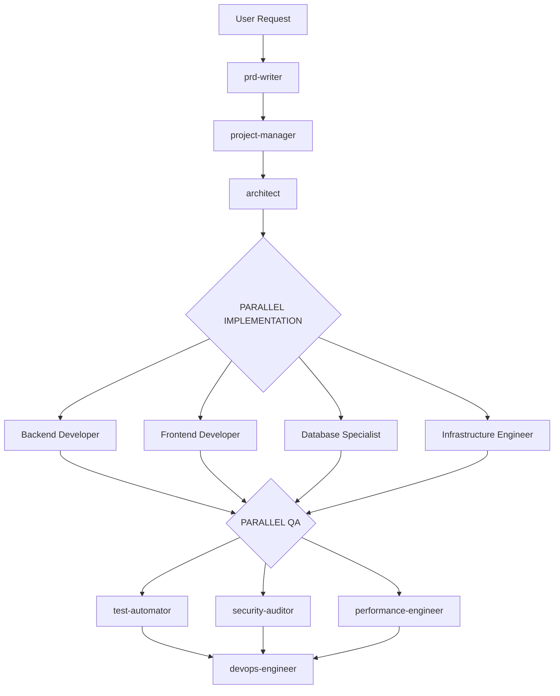
```mermaid
graph TD
    A[User Request] --> B[prd-writer]
    B --> C[project-manager]
    C --> D[architect]
    D --> E{PARALLEL IMPLEMENTATION}
    E --> F[Backend Developer]
    E --> G[Frontend Developer] 
    E --> H[Database Specialist]
    E --> I[Infrastructure Engineer]
    F --> J{PARALLEL QA}
    G --> J
    H --> J
    I --> J
    J --> K[test-automator]
    J --> L[security-auditor]
    J --> M[performance-engineer]
    K --> N[devops-engineer]
    L --> N
    M --> N
```

**PARALLEL COORDINATION PATTERN**:
```python
# Phase 1: Sequential (Architecture)
architect_task = Task(subagent_type="architect", ...)

# Phase 2: PARALLEL Implementation (Single Response)
backend_task = Task(subagent_type="backend-expert", ...)
frontend_task = Task(subagent_type="frontend-expert", ...)
database_task = Task(subagent_type="database-expert", ...)
infrastructure_task = Task(subagent_type="devops-engineer", ...)

# Phase 3: PARALLEL QA (Single Response)  
testing_task = Task(subagent_type="test-automator", ...)
security_task = Task(subagent_type="security-auditor", ...)
performance_task = Task(subagent_type="performance-engineer", ...)
```

**Detailed Steps**:

1. **Requirements Phase** (2-4 hours)
   - **prd-writer**: Creates comprehensive PRD with user stories, acceptance criteria
   - Output: Requirements document, user flows, success metrics

2. **Planning Phase** (1-2 hours)
   - **project-manager**: Breaks down into tasks, estimates effort, assigns agents
   - Output: Task breakdown, timeline, resource allocation

3. **Architecture Phase** (3-6 hours)
   - **architect**: Designs system architecture, API specifications, database schema
   - Input: PRD and project plan
   - Output: Technical design documents, API specs, database models

4. **Implementation Phase** (1-3 weeks, parallel)
   - **Backend**: Language expert (python-expert, go-expert, etc.) implements business logic
   - **Frontend**: Framework expert (react-expert, vue-expert, svelte-expert, remix-expert, astro-expert, qwik-expert, etc.) builds UI
   - **Database**: Database specialist designs and implements data layer
   - **Infrastructure**: devops-engineer sets up environments

5. **Quality Assurance Phase** (3-5 days, sequential)
   - **test-automator**: Implements comprehensive test suite
   - **security-auditor**: Reviews security vulnerabilities
   - **performance-engineer**: Optimizes performance bottlenecks
   - **accessibility-expert**: Ensures WCAG compliance

6. **Deployment Phase** (1-2 days)
   - **devops-engineer**: Deploys to production
   - **monitoring-expert**: Sets up observability
   - **incident-commander**: Prepares incident response

### 2. Bug Fix and Maintenance

**Scenario**: Fixing bugs, performance issues, or making small enhancements.

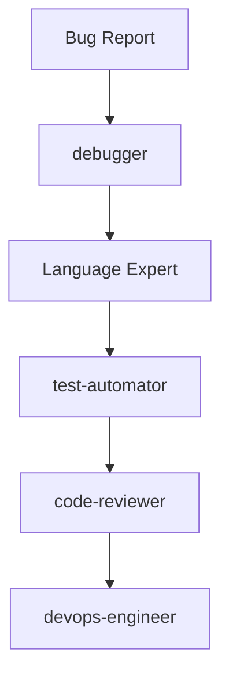
```mermaid
graph TD
    A[Bug Report] --> B[debugger]
    B --> C[Language Expert]
    C --> D[test-automator]
    D --> E[code-reviewer]
    E --> F[devops-engineer]
```

**Process**:
1. **debugger** analyzes issue and identifies root cause
2. **Language expert** implements fix
3. **test-automator** adds regression tests
4. **code-reviewer** ensures code quality
5. **devops-engineer** deploys fix

### 3. Infrastructure and DevOps Projects

**Scenario**: Setting up cloud infrastructure, CI/CD pipelines, or monitoring.

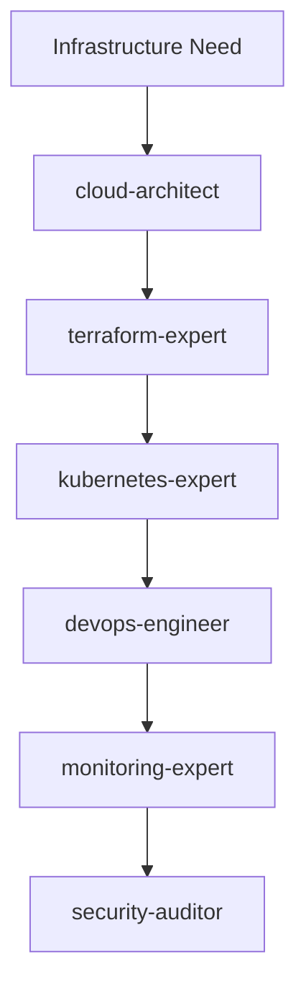
```mermaid
graph TD
    A[Infrastructure Need] --> B[cloud-architect]
    B --> C[terraform-expert]
    C --> D[kubernetes-expert]
    D --> E[devops-engineer]
    E --> F[monitoring-expert]
    F --> G[security-auditor]
```

**Process**:
1. **cloud-architect** designs cloud architecture
2. **terraform-expert** creates Infrastructure as Code
3. **kubernetes-expert** sets up container orchestration
4. **devops-engineer** implements CI/CD pipelines
5. **monitoring-expert** configures observability
6. **security-auditor** reviews security posture

### 4. Data Engineering and Analytics

**Scenario**: Building data pipelines, analytics dashboards, or ML systems.

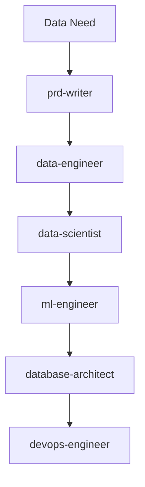
```mermaid
graph TD
    A[Data Need] --> B[prd-writer]
    B --> C[data-engineer]
    C --> D[data-scientist]
    D --> E[ml-engineer]
    E --> F[database-architect]
    F --> G[devops-engineer]
```

**Process**:
1. **prd-writer** defines data requirements and success metrics
2. **data-engineer** designs and builds ETL pipelines
3. **data-scientist** performs analysis and creates models
4. **ml-engineer** productionizes ML models
5. **database-architect** optimizes data storage
6. **devops-engineer** deploys data infrastructure

### 5. Mobile Application Development

**Scenario**: Creating mobile apps for iOS/Android.

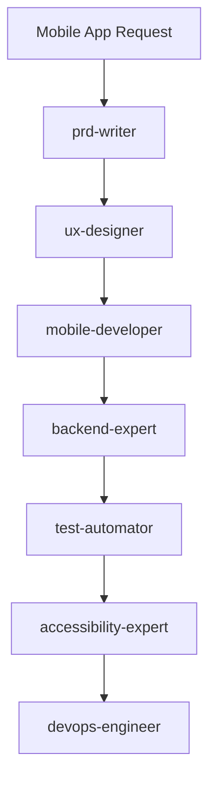
```mermaid
graph TD
    A[Mobile App Request] --> B[prd-writer]
    B --> C[ux-designer]
    C --> D[mobile-developer]
    D --> E[backend-expert]
    E --> F[test-automator]
    F --> G[accessibility-expert]
    G --> H[devops-engineer]
```

**Process**:
1. **prd-writer** defines mobile-specific requirements
2. **ux-designer** creates mobile-optimized designs
3. **mobile-developer** builds React Native/Flutter app
4. **Backend expert** creates mobile APIs
5. **test-automator** implements mobile testing
6. **accessibility-expert** ensures mobile accessibility
7. **devops-engineer** sets up mobile CI/CD

### 6. E-commerce and Payment Systems

**Scenario**: Building e-commerce features, payment processing, or financial systems.

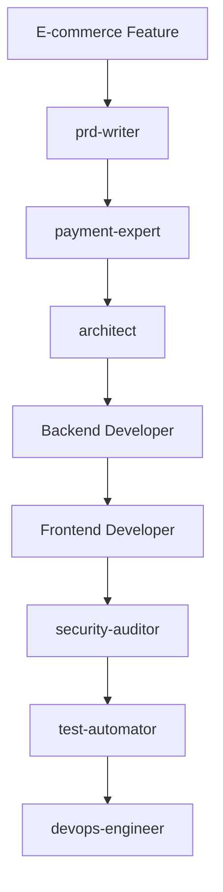
```mermaid
graph TD
    A[E-commerce Feature] --> B[prd-writer]
    B --> C[payment-expert]
    C --> D[architect]
    D --> E[Backend Developer]
    E --> F[Frontend Developer]
    F --> G[security-auditor]
    G --> H[test-automator]
    H --> I[devops-engineer]
```

**Process**:
1. **prd-writer** defines payment requirements and compliance needs
2. **payment-expert** designs payment integration architecture
3. **architect** creates secure system design
4. **Implementation teams** build payment flows
5. **security-auditor** performs PCI compliance review
6. **test-automator** creates payment testing suite
7. **devops-engineer** deploys with security monitoring

### 7. Financial Technology Projects

**Scenario**: Building banking integrations, trading platforms, or financial compliance systems.

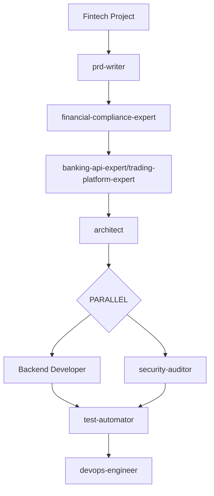
```mermaid
graph TD
    A[Fintech Project] --> B[prd-writer]
    B --> C[financial-compliance-expert]
    C --> D[banking-api-expert/trading-platform-expert]
    D --> E[architect]
    E --> F{PARALLEL}
    F --> G[Backend Developer]
    F --> H[security-auditor]
    G --> I[test-automator]
    H --> I
    I --> J[devops-engineer]
```

**Process**:
1. **prd-writer** defines financial requirements
2. **financial-compliance-expert** ensures regulatory compliance
3. **banking-api-expert** or **trading-platform-expert** designs integration
4. **architect** creates secure financial architecture
5. **Implementation teams** build with security-first approach
6. **security-auditor** performs financial security audit
7. **test-automator** creates compliance testing
8. **devops-engineer** deploys with audit logging

### 8. Healthcare and Compliance Projects

**Scenario**: Building healthcare applications with HIPAA/FHIR requirements.

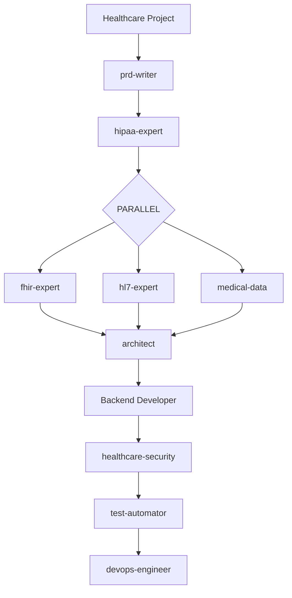
```mermaid
graph TD
    A[Healthcare Project] --> B[prd-writer]
    B --> C[hipaa-expert]
    C --> D{PARALLEL}
    D --> E[fhir-expert]
    D --> F[hl7-expert]
    D --> G[medical-data]
    E --> H[architect]
    F --> H
    G --> H
    H --> I[Backend Developer]
    I --> J[healthcare-security]
    J --> K[test-automator]
    K --> L[devops-engineer]
```

**Process**:
1. **prd-writer** defines healthcare requirements
2. **hipaa-expert** ensures HIPAA compliance framework
3. **Parallel specialists**:
   - **fhir-expert** designs FHIR-compliant data model
   - **hl7-expert** handles legacy system integration
   - **medical-data** designs clinical data architecture
   - **medical-imaging-expert** (if needed) handles DICOM/PACS
   - **clinical-trials-expert** (if needed) manages trial data
4. **architect** creates secure healthcare architecture
5. **Implementation teams** build healthcare features
6. **healthcare-security** performs security audit
7. **test-automator** creates compliance testing
8. **devops-engineer** deploys with audit logging

### 9. Government and Civic Technology

**Scenario**: Building digital government services, open data platforms, or civic engagement tools.

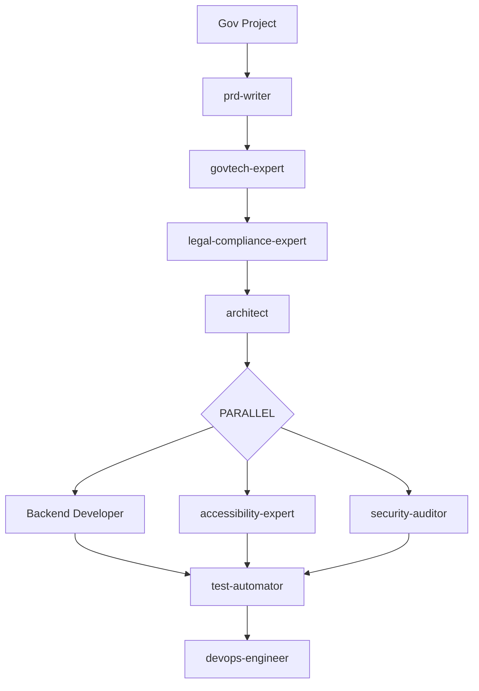
```mermaid
graph TD
    A[Gov Project] --> B[prd-writer]
    B --> C[govtech-expert]
    C --> D[legal-compliance-expert]
    D --> E[architect]
    E --> F{PARALLEL}
    F --> G[Backend Developer]
    F --> H[accessibility-expert]
    F --> I[security-auditor]
    G --> J[test-automator]
    H --> J
    I --> J
    J --> K[devops-engineer]
```

**Process**:
1. **prd-writer** defines government service requirements
2. **govtech-expert** ensures government standards compliance
3. **legal-compliance-expert** reviews regulatory requirements
4. **architect** designs secure, accessible architecture
5. **Parallel implementation**:
   - **Backend teams** build with privacy by design
   - **accessibility-expert** ensures WCAG 2.1 AA compliance
   - **security-auditor** performs government security review
6. **test-automator** creates comprehensive testing
7. **devops-engineer** deploys to government cloud

### 10. Education Technology Projects

**Scenario**: Building learning management systems, e-learning platforms, or educational tools.

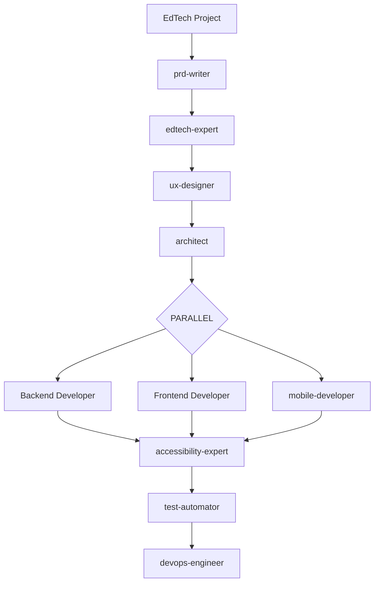
```mermaid
graph TD
    A[EdTech Project] --> B[prd-writer]
    B --> C[edtech-expert]
    C --> D[ux-designer]
    D --> E[architect]
    E --> F{PARALLEL}
    F --> G[Backend Developer]
    F --> H[Frontend Developer]
    F --> I[mobile-developer]
    G --> J[accessibility-expert]
    H --> J
    I --> J
    J --> K[test-automator]
    K --> L[devops-engineer]
```

**Process**:
1. **prd-writer** defines educational requirements
2. **edtech-expert** designs pedagogical features
3. **ux-designer** creates learner-centric designs
4. **architect** designs scalable LMS architecture
5. **Parallel implementation**:
   - **Backend teams** build content delivery systems
   - **Frontend teams** create interactive learning interfaces
   - **mobile-developer** builds mobile learning apps
6. **accessibility-expert** ensures educational accessibility
7. **test-automator** creates learning flow testing
8. **devops-engineer** deploys with CDN optimization

### 11. Cloud Cost Optimization Projects

**Scenario**: Reducing cloud infrastructure costs across AWS, Azure, or GCP.

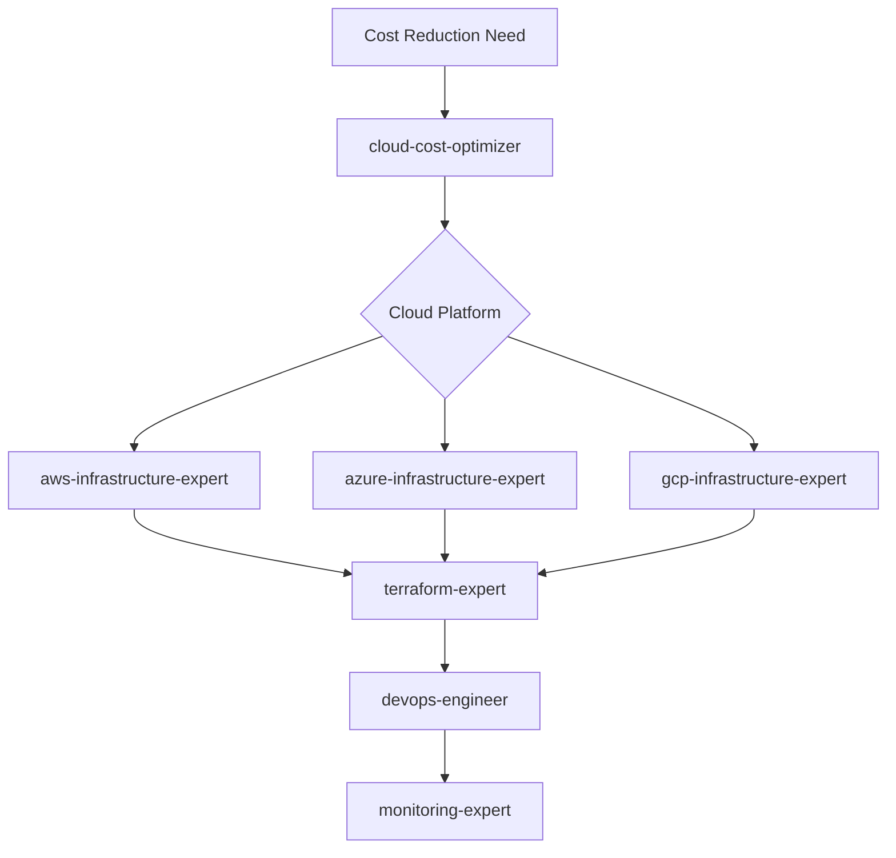
```mermaid
graph TD
    A[Cost Reduction Need] --> B[cloud-cost-optimizer]
    B --> C{Cloud Platform}
    C --> D[aws-infrastructure-expert]
    C --> E[azure-infrastructure-expert]
    C --> F[gcp-infrastructure-expert]
    D --> G[terraform-expert]
    E --> G
    F --> G
    G --> H[devops-engineer]
    H --> I[monitoring-expert]
```

**Process**:
1. **cloud-cost-optimizer** analyzes current spending
2. **Platform-specific expert** (aws/azure/gcp) implements optimizations
3. **terraform-expert** codifies cost-efficient infrastructure
4. **devops-engineer** implements automated cost controls
5. **monitoring-expert** sets up cost monitoring dashboards

## 🔀 Conditional Routing Logic

### Project Complexity Assessment

**High Complexity** (Use full workflow with prd-writer):
- Multiple components/services
- Multiple user types
- Complex business logic
- Compliance requirements
- Timeline > 2 weeks
- Team size > 3 people

**Medium Complexity** (Start with project-manager):
- Single component with multiple features
- Well-defined requirements
- Timeline 1-2 weeks
- Team size 2-3 people

**Low Complexity** (Direct to specialist):
- Single feature/fix
- Clear implementation path
- Timeline < 1 week
- Individual contributor

### Technology Stack Routing

**Backend Technologies**:
```
Django project → django-expert
FastAPI project → fastapi-expert
Python (general) → python-expert
Node.js/Express → javascript-expert
NestJS → typescript-expert
Spring Boot → spring-expert
Go services → go-expert
Rust systems → rust-expert
.NET applications → csharp-expert
Scala/Akka → scala-expert
Ruby applications → ruby-expert
Elixir/Phoenix → elixir-expert
Kotlin backend → kotlin-expert
PHP/Laravel → php-expert
Swift backend → swift-expert
```

**Frontend Frameworks**:
```
React → react-expert
Next.js (advanced) → nextjs-expert
Vue/Nuxt → vue-expert
Angular → angular-expert
React Native → mobile-developer
Flutter → mobile-developer
Swift/SwiftUI → swift-expert
Kotlin Android → kotlin-expert
```

**Database Systems**:
```
PostgreSQL → postgresql-expert
MongoDB → mongodb-expert
Complex data modeling → database-architect
```

**Infrastructure Platforms**:
```
AWS → cloud-architect / aws-infrastructure-expert
Azure → cloud-architect / azure-infrastructure-expert
GCP → cloud-architect / gcp-infrastructure-expert
Multi-cloud → cloud-architect
Cost optimization → cloud-cost-optimizer
Kubernetes → kubernetes-expert
Terraform → terraform-expert
CI/CD → devops-engineer
Monitoring → monitoring-expert
```

**API Technologies**:
```
GraphQL → graphql-expert
gRPC → grpc-expert
WebSocket → websocket-expert
REST API → backend language expert
```

**Testing Specialists**:
```
E2E Testing → e2e-testing-expert (Playwright, Cypress, Selenium)
Load Testing → load-testing-expert (k6, JMeter, Gatling)
Contract Testing → contract-testing-expert (Pact, Spring Cloud Contract)
Chaos Testing → chaos-engineer (Chaos Monkey, Litmus, Gremlin)
Unit/Integration → test-automator
Security Testing → security-auditor
Accessibility → accessibility-expert
Performance → performance-engineer
```

**Industry Verticals**:
```
Banking/Finance → banking-api-expert / trading-platform-expert / financial-compliance-expert
Healthcare → fhir-expert / hipaa-expert / healthcare-security / medical-imaging-expert
Government → govtech-expert
Education → edtech-expert
E-commerce → payment-expert
```

**Business Functions**:
```
Product Strategy → product-manager
Requirements Analysis → business-analyst
Growth Strategy → growth-hacker
Customer Success → customer-success-manager
Legal/Compliance → legal-compliance-expert
```

**Marketing Functions**:
```
Content Strategy → content-strategist
SEO → seo-expert
Sales Copy → copywriter
Technical Documentation → technical-writer
API Documentation → api-documenter
```

## 🎭 Agent Handoff Patterns

### Sequential Handoff
Each agent passes complete outputs to the next agent:
```
Agent A → Complete Output → Agent B → Enhanced Output → Agent C
```

### Parallel Coordination
Multiple agents work simultaneously with shared context:
```
Coordinator → [Agent A + Agent B + Agent C] → Integration
```

### Iterative Refinement
Agents collaborate to refine outputs:
```
Agent A → Draft → Agent B → Review → Agent A → Final
```

### Validation Loop
Quality gates ensure standards are met:
```
Implementation → Validator → (Pass/Fail) → Next Phase/Rework
```

## 📊 Success Metrics and KPIs

### Workflow Efficiency
- Time from request to first deliverable
- Number of handoffs required
- Agent utilization rates

### Quality Metrics
- Code review pass rate
- Security vulnerability count
- Test coverage percentage
- Performance benchmark compliance

### Project Success
- Requirements traceability
- Timeline adherence
- Stakeholder satisfaction
- Post-deployment incident rate

## 🛠️ Customization Guidelines

### Adding Domain-Specific Workflows

1. **Identify unique requirements** for your domain
2. **Map required specialists** to your technology stack
3. **Define handoff points** between agents
4. **Create validation criteria** for each phase
5. **Document the workflow** for team consistency

### Adapting to Team Size

**Small Teams (1-3 people)**:
- Combine agent roles
- Use simplified workflows
- Focus on essential phases

**Medium Teams (4-10 people)**:
- Full agent specialization
- Parallel work streams
- Regular coordination points

**Large Teams (10+ people)**:
- Multiple parallel workflows
- Dedicated coordinators
- Advanced orchestration

### Technology-Specific Adaptations

**Microservices Architecture**:
- Separate workflows per service
- Service-level architects
- Cross-service integration testing

**Monolithic Applications**:
- Single comprehensive workflow
- Module-based task breakdown
- Integrated testing approach

**Serverless Applications**:
- Function-level decomposition
- Event-driven coordination
- Performance optimization focus

## 📚 Workflow Examples

### Example 1: E-Learning Platform

**Request**: "Build an online course platform with video streaming, quizzes, and progress tracking"

**Workflow Execution**:

1. **prd-writer** (4 hours)
   - Defines user personas: students, instructors, admins
   - Creates user stories for video watching, quiz taking, progress tracking
   - Specifies success metrics: engagement rate, completion rate

2. **project-manager** (2 hours)
   - Breaks down into: video service, quiz engine, progress tracking, user management
   - Estimates 6-week timeline with 4-person team
   - Assigns: backend (Python), frontend (React), database (PostgreSQL), DevOps

3. **architect** (6 hours)
   - Designs microservices architecture
   - Specifies video streaming with CDN integration
   - Creates API specifications for all services
   - Plans database schema for courses, users, progress

4. **Implementation** (4 weeks parallel)
   - **python-expert**: Builds Django REST APIs for courses, users, quiz engine
   - **react-expert**: Creates responsive UI with video player, quiz components
   - **postgresql-expert**: Optimizes database for video metadata and user progress
   - **devops-engineer**: Sets up container deployment and CDN integration

5. **Quality Assurance** (1 week)
   - **test-automator**: Creates E2E tests for learning workflows
   - **performance-engineer**: Optimizes video streaming performance
   - **accessibility-expert**: Ensures course content is accessible
   - **security-auditor**: Reviews user data protection

6. **Deployment** (3 days)
   - **devops-engineer**: Deploys to production with monitoring
   - **monitoring-expert**: Sets up analytics for learning metrics

### Example 2: IoT Dashboard

**Request**: "Create a dashboard to monitor industrial sensors with real-time alerts"

**Workflow Execution**:

1. **prd-writer** (2 hours)
   - Defines sensor types, alert conditions, dashboard requirements
   - Specifies real-time data visualization needs

2. **iot-expert** (3 hours)
   - Designs IoT data ingestion architecture
   - Specifies MQTT protocols and data formats

3. **data-engineer** (1 week)
   - Builds real-time data pipeline with Apache Kafka
   - Creates time-series database integration

4. **react-expert** (2 weeks)
   - Builds real-time dashboard with WebSocket updates
   - Creates data visualization components

5. **devops-engineer** (3 days)
   - Deploys IoT infrastructure with monitoring

## 🚀 Parallel Execution Optimization

### Key Parallel Patterns by Project Type

#### **Standard Web Application** 
```
Architecture → [Backend + Frontend + Database] → [Testing + Security] → Deployment
Duration: ~20 hours (vs 40+ sequential)
```

#### **Microservices Project**
```
Architecture → [Service1 + Service2 + Service3 + Database + Infrastructure] → [Testing + Security] → Deployment  
Duration: ~25 hours (vs 60+ sequential)
```

#### **E-commerce Platform**
```
[Payment Architecture + System Architecture] → [Backend + Frontend + Database + Payment Integration] → [Security + Performance + Testing] → Deployment
Duration: ~30 hours (vs 70+ sequential)
```

#### **Mobile Application**
```
[UX Design + Mobile Architecture] → [Mobile App + Backend APIs + Database] → [Mobile Testing + Accessibility] → Deployment
Duration: ~25 hours (vs 50+ sequential)
```

### Parallel Coordination Best Practices

#### ✅ **Effective Parallel Patterns**:
```python
# GOOD: Multiple Task calls in single response
def coordinate_parallel_implementation():
    backend_task = Task(subagent_type="backend-expert", ...)
    frontend_task = Task(subagent_type="frontend-expert", ...)
    database_task = Task(subagent_type="database-expert", ...)
    # All execute concurrently
```

#### ❌ **Anti-Patterns to Avoid**:
```python
# BAD: Sequential task delegation
def coordinate_sequential_implementation():
    backend_task = Task(subagent_type="backend-expert", ...)
    # Wait for completion...
    frontend_task = Task(subagent_type="frontend-expert", ...)
    # Wait for completion...
    database_task = Task(subagent_type="database-expert", ...)
    # Takes 3x longer
```

### Parallel Dependency Management

#### **Phase-Based Dependencies**:
```yaml
phase_dependencies:
  requirements: []                                    # No dependencies
  architecture: [requirements]                       # Sequential
  implementation: [architecture]                     # Parallel after architecture
  quality: [implementation]                          # Parallel after implementation  
  deployment: [quality]                             # Sequential after QA
```

#### **Agent Compatibility Matrix**:
```yaml
parallel_compatible:
  implementation_phase:
    - [backend-expert, frontend-expert, database-expert]
    - [python-expert, react-expert, postgresql-expert] 
    - [go-expert, vue-expert, mongodb-expert]
  
  quality_phase:
    - [test-automator, security-auditor, performance-engineer]
    - [accessibility-expert, test-automator]
    
  infrastructure_phase:
    - [devops-engineer, cloud-architect, monitoring-expert]
```

## 🎯 Advanced Patterns

### Cross-Project Dependencies
When projects depend on each other:
```
Project A → Shared Component → Project B
    ↓            ↓                ↓
Agent Team A → Architect → Agent Team B
```

### Legacy System Integration
When working with existing systems:
```
Legacy Analysis → Migration Strategy → Incremental Implementation
```

### Compliance-First Development
When regulatory compliance is critical:
```
Compliance Review → Secure Architecture → Implementation → Audit
```

### Rapid Prototyping
When speed is critical:
```
MVP Requirements → Quick Implementation → User Feedback → Iteration
```

## 🌐 Cross-Functional Workflows

### 8. Product Launch with Marketing Campaign

**Scenario**: Launching a new B2B SaaS product with comprehensive marketing strategy.

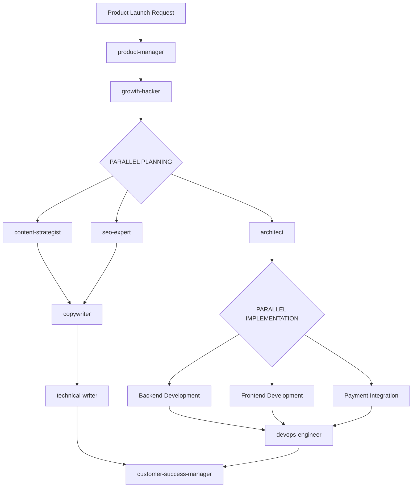
```mermaid
graph TD
    A[Product Launch Request] --> B[product-manager]
    B --> C[growth-hacker]
    C --> D{PARALLEL PLANNING}
    D --> E[content-strategist]
    D --> F[seo-expert]
    D --> G[architect]
    E --> H[copywriter]
    F --> H
    G --> I{PARALLEL IMPLEMENTATION}
    I --> J[Backend Development]
    I --> K[Frontend Development]
    I --> L[Payment Integration]
    H --> M[technical-writer]
    J --> N[devops-engineer]
    K --> N
    L --> N
    M --> O[customer-success-manager]
    N --> O
```

**Process**:
1. **product-manager** defines positioning, pricing, and go-to-market strategy
2. **growth-hacker** creates viral loops and referral programs
3. **PARALLEL**: Marketing and technical teams work simultaneously
   - **content-strategist** + **seo-expert** create content strategy
   - **architect** designs technical architecture
4. **copywriter** creates sales materials and marketing copy
5. **Implementation teams** build the product
6. **technical-writer** creates documentation
7. **devops-engineer** handles deployment
8. **customer-success-manager** prepares onboarding

### 9. API Modernization Project

**Scenario**: Migrating from REST to GraphQL with real-time features.

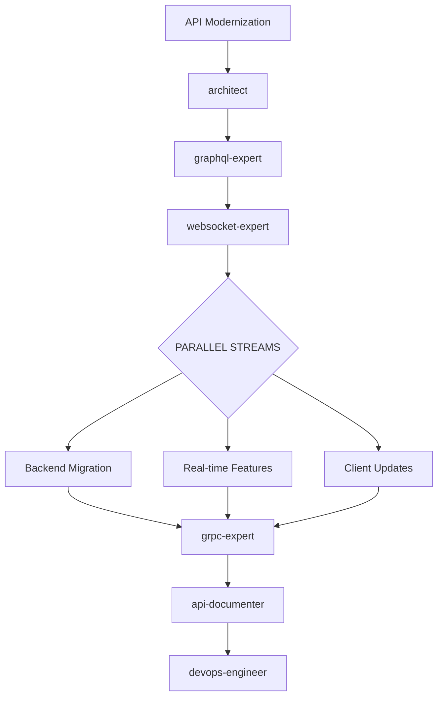
```mermaid
graph TD
    A[API Modernization] --> B[architect]
    B --> C[graphql-expert]
    C --> D[websocket-expert]
    D --> E{PARALLEL STREAMS}
    E --> F[Backend Migration]
    E --> G[Real-time Features]
    E --> H[Client Updates]
    F --> I[grpc-expert]
    G --> I
    H --> I
    I --> J[api-documenter]
    J --> K[devops-engineer]
```

**Process**:
1. **architect** designs overall API modernization strategy
2. **graphql-expert** creates GraphQL schema and migration plan
3. **websocket-expert** designs real-time subscription architecture
4. **PARALLEL Implementation**:
   - Backend team migrates REST endpoints to GraphQL
   - Real-time team implements WebSocket subscriptions
   - Client teams update SDKs
5. **grpc-expert** implements microservice communication
6. **api-documenter** creates comprehensive API documentation
7. **devops-engineer** handles staged rollout

### 10. Legal Compliance Implementation

**Scenario**: Implementing GDPR compliance across the platform.

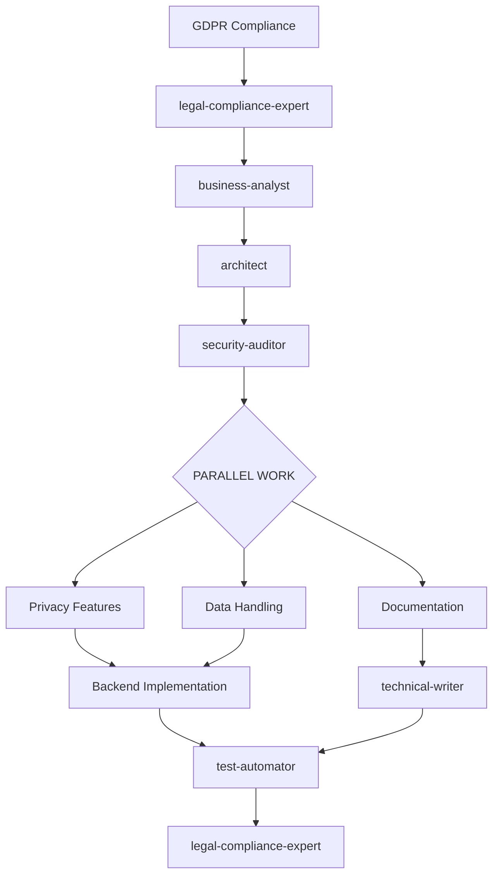
```mermaid
graph TD
    A[GDPR Compliance] --> B[legal-compliance-expert]
    B --> C[business-analyst]
    C --> D[architect]
    D --> E[security-auditor]
    E --> F{PARALLEL WORK}
    F --> G[Privacy Features]
    F --> H[Data Handling]
    F --> I[Documentation]
    G --> J[Backend Implementation]
    H --> J
    I --> K[technical-writer]
    J --> L[test-automator]
    K --> L
    L --> M[legal-compliance-expert]
```

**Process**:
1. **legal-compliance-expert** performs gap analysis and defines requirements
2. **business-analyst** maps data flows and processes
3. **architect** designs privacy-first architecture
4. **security-auditor** defines security controls
5. **PARALLEL Implementation**:
   - Privacy features (consent management, data portability)
   - Data handling (retention, anonymization)
   - Documentation updates
6. **test-automator** creates compliance tests
7. **legal-compliance-expert** validates compliance

### 11. Growth Marketing Campaign

**Scenario**: Implementing growth experiments and content marketing.

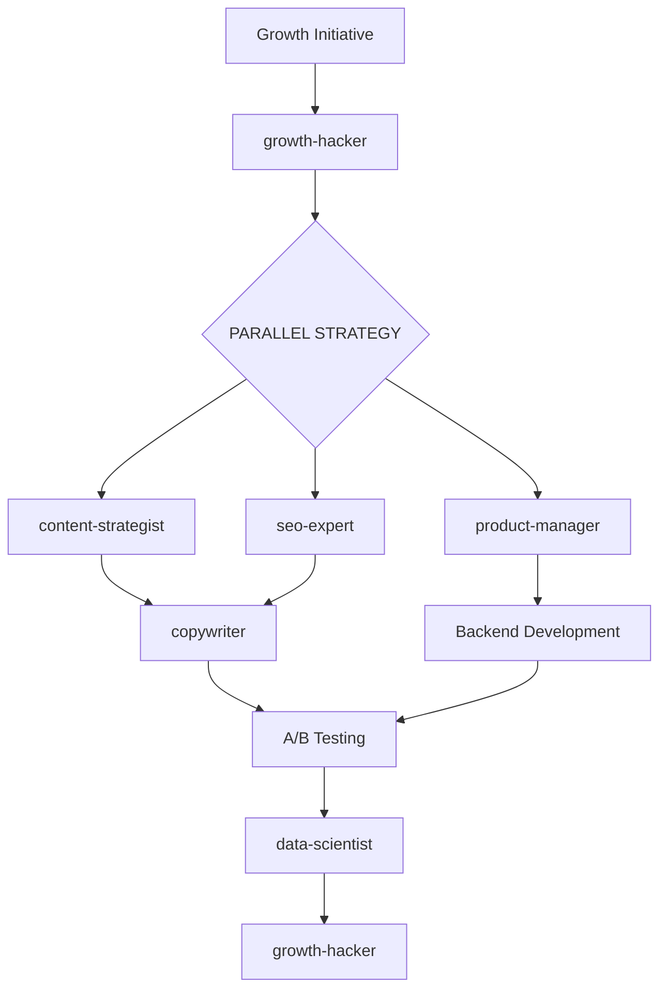
```mermaid
graph TD
    A[Growth Initiative] --> B[growth-hacker]
    B --> C{PARALLEL STRATEGY}
    C --> D[content-strategist]
    C --> E[seo-expert]
    C --> F[product-manager]
    D --> G[copywriter]
    E --> G
    F --> H[Backend Development]
    G --> I[A/B Testing]
    H --> I
    I --> J[data-scientist]
    J --> K[growth-hacker]
```

**Process**:
1. **growth-hacker** designs growth experiments and viral mechanics
2. **PARALLEL Planning**:
   - **content-strategist** creates content calendar
   - **seo-expert** identifies keyword opportunities
   - **product-manager** defines feature experiments
3. **copywriter** creates conversion-optimized content
4. **Implementation** of growth features
5. **A/B Testing** of variations
6. **data-scientist** analyzes results
7. **growth-hacker** iterates based on data

### 12. Customer Success Initiative

**Scenario**: Improving customer retention and satisfaction.

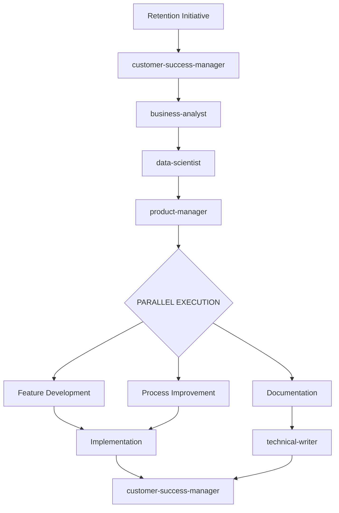
```mermaid
graph TD
    A[Retention Initiative] --> B[customer-success-manager]
    B --> C[business-analyst]
    C --> D[data-scientist]
    D --> E[product-manager]
    E --> F{PARALLEL EXECUTION}
    F --> G[Feature Development]
    F --> H[Process Improvement]
    F --> I[Documentation]
    G --> J[Implementation]
    H --> J
    I --> K[technical-writer]
    J --> L[customer-success-manager]
    K --> L
```

**Process**:
1. **customer-success-manager** identifies retention challenges
2. **business-analyst** analyzes customer journey and pain points
3. **data-scientist** performs churn analysis
4. **product-manager** prioritizes improvements
5. **PARALLEL Work**:
   - Feature development for customer needs
   - Process improvements for support
   - Documentation updates
6. **Implementation** and rollout
7. **customer-success-manager** monitors impact

## 🔄 Cross-Functional Handoff Patterns

### Business-to-Technical Handoff
```
product-manager → PRD → architect → Technical Specs → developers
business-analyst → Requirements → data-engineer → Implementation
```

### Marketing-to-Product Handoff
```
content-strategist → Content Plan → product-manager → Feature Requirements
seo-expert → Keyword Research → copywriter → Optimized Content
```

### Compliance-to-Engineering Handoff
```
legal-compliance-expert → Compliance Requirements → security-auditor → Security Controls → developers
```

### Customer-to-Product Handoff
```
customer-success-manager → Customer Feedback → product-manager → Feature Prioritization → developers
```

## 📊 Cross-Functional Success Metrics

### Business Metrics
- Customer acquisition cost (CAC)
- Customer lifetime value (LTV)
- Net promoter score (NPS)
- Monthly recurring revenue (MRR)

### Marketing Metrics
- Organic traffic growth
- Conversion rate optimization
- Content engagement rates
- Lead quality scores

### Technical Metrics
- API response times
- System uptime
- Code coverage
- Security vulnerability count

### Compliance Metrics
- Audit pass rate
- Data request response time
- Compliance training completion
- Incident response time

---

These workflow patterns provide a comprehensive framework for coordinating Claude Code subagents across any type of project, including cross-functional initiatives that span business, marketing, legal, and technical domains.

## 🚀 Phase 2 Advanced Workflow Patterns

### 13. Quantum Computing Platform Development

**Scenario**: Building a quantum computing simulation platform with visualization.

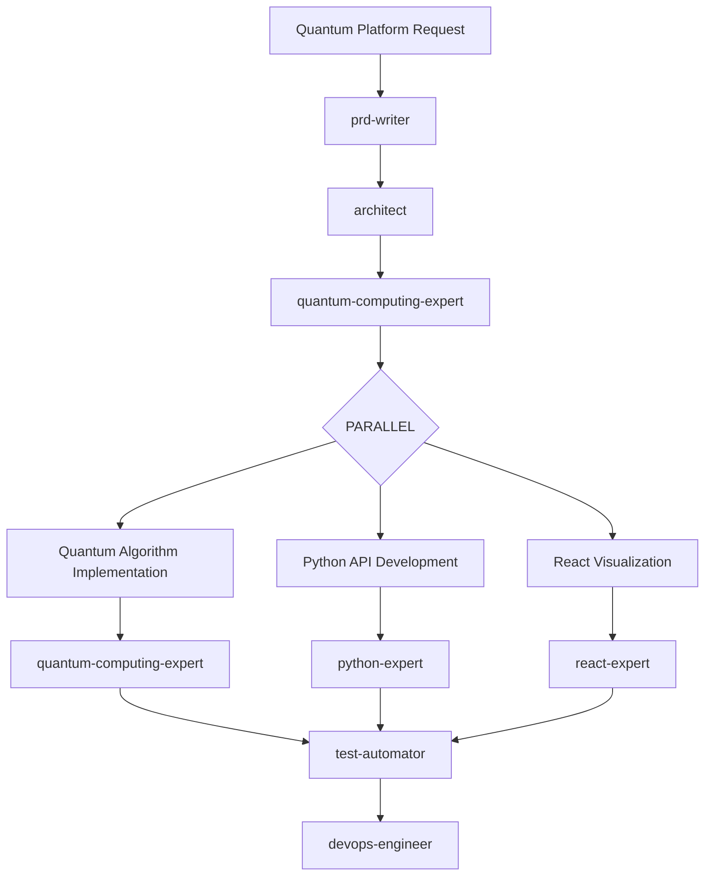
```mermaid
graph TD
    A[Quantum Platform Request] --> B[prd-writer]
    B --> C[architect]
    C --> D[quantum-computing-expert]
    D --> E{PARALLEL}
    E --> F[Quantum Algorithm Implementation]
    E --> G[Python API Development]
    E --> H[React Visualization]
    F --> I[quantum-computing-expert]
    G --> J[python-expert]
    H --> K[react-expert]
    I --> L[test-automator]
    J --> L
    K --> L
    L --> M[devops-engineer]
```

**Process**:
1. **prd-writer** defines quantum simulation requirements
2. **architect** designs overall system architecture
3. **quantum-computing-expert** specifies quantum algorithms and circuits
4. **PARALLEL Implementation**:
   - **quantum-computing-expert** implements quantum circuits with Qiskit/Cirq
   - **python-expert** builds REST API for quantum operations
   - **react-expert** creates circuit visualization interface
5. **test-automator** validates quantum computations
6. **devops-engineer** deploys with GPU support

### 14. Real-Time Analytics Dashboard

**Scenario**: Building streaming analytics with data quality monitoring.

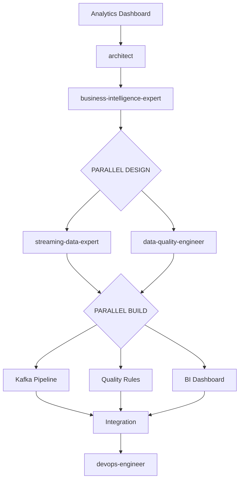
```mermaid
graph TD
    A[Analytics Dashboard] --> B[architect]
    B --> C[business-intelligence-expert]
    C --> D{PARALLEL DESIGN}
    D --> E[streaming-data-expert]
    D --> F[data-quality-engineer]
    E --> G{PARALLEL BUILD}
    F --> G
    G --> H[Kafka Pipeline]
    G --> I[Quality Rules]
    G --> J[BI Dashboard]
    H --> K[Integration]
    I --> K
    J --> K
    K --> L[devops-engineer]
```

**Process**:
1. **architect** designs data architecture
2. **business-intelligence-expert** defines KPIs and dashboard requirements
3. **PARALLEL Design**:
   - **streaming-data-expert** designs real-time data pipeline
   - **data-quality-engineer** creates validation rules
4. **PARALLEL Implementation**:
   - Kafka streaming pipeline setup
   - Data quality monitoring implementation
   - Real-time dashboard development
5. **Integration** of all components
6. **devops-engineer** deploys with monitoring

### 15. ML Research Infrastructure

**Scenario**: Setting up experimentation platform for ML research.

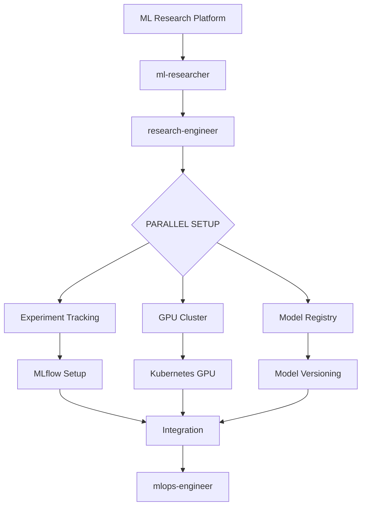
```mermaid
graph TD
    A[ML Research Platform] --> B[ml-researcher]
    B --> C[research-engineer]
    C --> D{PARALLEL SETUP}
    D --> E[Experiment Tracking]
    D --> F[GPU Cluster]
    D --> G[Model Registry]
    E --> H[MLflow Setup]
    F --> I[Kubernetes GPU]
    G --> J[Model Versioning]
    H --> K[Integration]
    I --> K
    J --> K
    K --> L[mlops-engineer]
```

**Process**:
1. **ml-researcher** defines research requirements
2. **research-engineer** designs infrastructure
3. **PARALLEL Setup**:
   - Experiment tracking with MLflow/Weights & Biases
   - GPU cluster orchestration
   - Model registry and versioning
4. **Integration** of research tools
5. **mlops-engineer** operationalizes the platform

### 16. AR/VR Game Development

**Scenario**: Creating AR mobile game with AI-powered NPCs.

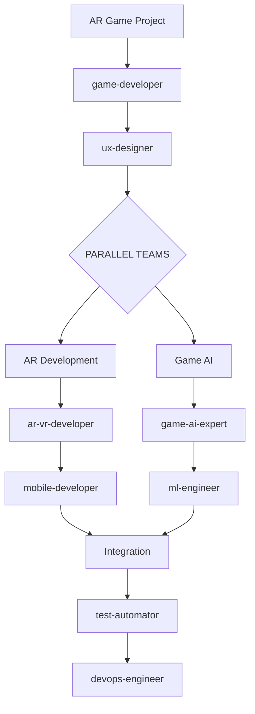
```mermaid
graph TD
    A[AR Game Project] --> B[game-developer]
    B --> C[ux-designer]
    C --> D{PARALLEL TEAMS}
    D --> E[AR Development]
    D --> F[Game AI]
    E --> G[ar-vr-developer]
    F --> H[game-ai-expert]
    G --> I[mobile-developer]
    H --> J[ml-engineer]
    I --> K[Integration]
    J --> K
    K --> L[test-automator]
    L --> M[devops-engineer]
```

**Process**:
1. **game-developer** creates game design document
2. **ux-designer** designs AR interactions
3. **PARALLEL Development**:
   - **AR Team**: ar-vr-developer + mobile-developer build AR features
   - **AI Team**: game-ai-expert + ml-engineer create NPC behaviors
4. **Integration** of AR and AI systems
5. **test-automator** creates gameplay tests
6. **devops-engineer** handles app deployment

### 17. Platform Internationalization

**Scenario**: Full i18n implementation for global SaaS platform.

```mermaid
graph TD
    A[i18n Project] --> B[i18n-expert]
    B --> C[architect]
    C --> D{PARALLEL STREAMS}
    D --> E[Backend i18n]
    D --> F[Frontend i18n]
    D --> G[Content Localization]
    E --> H[API Updates]
    F --> I[UI Adaptation]
    G --> J[Translation Workflow]
    H --> K[localization-engineer]
    I --> K
    J --> K
    K --> L[test-automator]
```

**Process**:
1. **i18n-expert** creates internationalization strategy
2. **architect** designs i18n architecture
3. **PARALLEL Implementation**:
   - Backend message extraction and locale management
   - Frontend UI adaptation and RTL support
   - Content localization workflow setup
4. **localization-engineer** integrates all components
5. **test-automator** validates all locales

### 18. Embedded IoT System

**Scenario**: Building embedded system for industrial IoT monitoring.

```mermaid
graph TD
    A[IoT System] --> B[iot-expert]
    B --> C[embedded-systems-expert]
    C --> D{PARALLEL DEV}
    D --> E[Firmware]
    D --> F[Cloud Backend]
    D --> G[Dashboard]
    E --> H[C/C++ Code]
    F --> I[MQTT Gateway]
    G --> J[React Dashboard]
    H --> K[Integration]
    I --> K
    J --> K
    K --> L[devops-engineer]
```

**Process**:
1. **iot-expert** designs IoT architecture
2. **embedded-systems-expert** specifies hardware requirements
3. **PARALLEL Development**:
   - Firmware development for sensors
   - Cloud backend for data ingestion
   - Real-time monitoring dashboard
4. **Integration** and testing
5. **devops-engineer** deploys cloud infrastructure

### 19. Compiler Development Project

**Scenario**: Building domain-specific language compiler.

```mermaid
graph TD
    A[DSL Compiler] --> B[compiler-engineer]
    B --> C[architect]
    C --> D{PHASES}
    D --> E[Lexer/Parser]
    D --> F[AST/IR]
    D --> G[Code Generation]
    E --> H[ANTLR/Flex]
    F --> I[LLVM IR]
    G --> J[Target Code]
    H --> K[rust-expert]
    I --> K
    J --> K
    K --> L[test-automator]
```

**Process**:
1. **compiler-engineer** designs language specification
2. **architect** creates compiler architecture
3. **Sequential Phases**:
   - Lexer/Parser implementation
   - AST and IR generation
   - Code generation and optimization
4. **rust-expert** implements in Rust
5. **test-automator** creates language test suite

### 20. Website Architecture Planning

**Scenario**: Comprehensive website planning for SaaS product.

```mermaid
graph TD
    A[Website Planning] --> B[website-architect]
    B --> C[product-manager]
    C --> D{PARALLEL PLANNING}
    D --> E[Information Architecture]
    D --> F[Conversion Strategy]
    D --> G[SEO Planning]
    E --> H[ux-designer]
    F --> I[copywriter]
    G --> J[seo-expert]
    H --> K[Implementation]
    I --> K
    J --> K
    K --> L[react-expert]
    L --> M[devops-engineer]
```

**Process**:
1. **website-architect** creates site architecture and user journeys
2. **product-manager** aligns with product strategy
3. **PARALLEL Planning**:
   - Information architecture and wireframes
   - Conversion optimization strategy
   - Technical SEO planning
4. **Implementation** by frontend team
5. **devops-engineer** handles deployment and CDN

### 21. Security Penetration Testing

**Scenario**: Comprehensive security assessment and hardening.

```mermaid
graph TD
    A[Security Assessment] --> B[security-penetration-tester]
    B --> C{ASSESSMENT PHASES}
    C --> D[Reconnaissance]
    C --> E[Vulnerability Scanning]
    C --> F[Exploitation Testing]
    D --> G[Report Generation]
    E --> G
    F --> G
    G --> H[security-auditor]
    H --> I[Remediation Plan]
    I --> J[developers]
    J --> K[security-penetration-tester]
```

**Process**:
1. **security-penetration-tester** performs initial reconnaissance
2. **Assessment Phases**:
   - Network and application scanning
   - Vulnerability identification
   - Safe exploitation testing
3. **Report Generation** with findings
4. **security-auditor** reviews and prioritizes
5. **Remediation** by development team
6. **Re-testing** to verify fixes

## 🔄 Phase 2 Integration Patterns

### Advanced Technology Integration
```
Quantum/AI/AR → Research Infrastructure → Production Systems
quantum-expert → research-engineer → mlops-engineer → devops
```

### Localization Pipeline
```
Product Development → i18n Planning → Implementation → Content Translation
developers → i18n-expert → localization-engineer → content team
```

### Security-First Development
```
Threat Modeling → Secure Architecture → Implementation → Penetration Testing
security-penetration-tester → architect → developers → security-auditor
```

### Website Development Flow
```
Strategy → Architecture → Design → Implementation → Optimization
website-architect → ux-designer → developers → seo-expert
```

## 📊 Phase 2 Metrics

### Research & Innovation
- Experiment reproducibility rate
- Model performance improvements
- Research-to-production time

### Localization Success
- Supported locale count
- Translation accuracy
- Regional user adoption

### Security Effectiveness
- Vulnerabilities found vs fixed
- Time to remediation
- Security incident reduction

### Website Performance
- Conversion rate improvements
- Page load times
- SEO ranking improvements

## 🌐 SEO & GEO Optimization Workflows

### 22. Comprehensive SEO Implementation

**Scenario**: Full technical SEO overhaul for improved search visibility.

```mermaid
graph TD
    A[SEO Project] --> B[seo-strategist]
    B --> C{AUDIT PHASE}
    C --> D[Technical Audit]
    C --> E[Content Audit]
    C --> F[Competitor Analysis]
    D --> G[seo-implementation-expert]
    E --> G
    F --> G
    G --> H{PARALLEL IMPLEMENTATION}
    H --> I[Meta Tags & Schema]
    H --> J[Site Architecture]
    H --> K[Core Web Vitals]
    H --> L[Content Optimization]
    I --> M[Integration]
    J --> M
    K --> M
    L --> M
    M --> N[monitoring-expert]
```

**Process**:
1. **seo-strategist** performs comprehensive SEO audit
2. **Audit Phase**:
   - Technical SEO issues identification
   - Content gap analysis
   - Competitor benchmarking
3. **seo-implementation-expert** creates implementation plan
4. **PARALLEL Implementation**:
   - Meta tags, schema markup, and structured data
   - Site architecture and internal linking
   - Core Web Vitals optimization
   - Content optimization and keyword integration
5. **Integration** and testing
6. **monitoring-expert** sets up SEO tracking dashboards

### 23. Generative Engine Optimization (GEO)

**Scenario**: Optimizing content for AI-powered search engines.

```mermaid
graph TD
    A[GEO Initiative] --> B[geo-strategist]
    B --> C{PLATFORM ANALYSIS}
    C --> D[ChatGPT Optimization]
    C --> E[Perplexity Optimization]
    C --> F[Claude/Gemini Optimization]
    D --> G[geo-implementation-expert]
    E --> G
    F --> G
    G --> H{PARALLEL WORK}
    H --> I[llms.txt Creation]
    H --> J[Content Restructuring]
    H --> K[Citation Integration]
    H --> L[Schema Enhancement]
    I --> M[Testing & Validation]
    J --> M
    K --> M
    L --> M
    M --> N[Performance Tracking]
```

**Process**:
1. **geo-strategist** analyzes AI platform requirements
2. **Platform Analysis**:
   - ChatGPT-specific optimizations
   - Perplexity citation preferences
   - Claude/Gemini content structuring
3. **geo-implementation-expert** executes optimization
4. **PARALLEL Implementation**:
   - llms.txt and llms-full.txt file creation
   - Content restructuring for AI comprehension
   - Citation and statistics integration
   - Enhanced schema markup for knowledge graphs
5. **Testing** across AI platforms
6. **Performance Tracking** of AI visibility

### 24. SEO & GEO Integration Strategy

**Scenario**: Unified optimization for traditional and AI search.

```mermaid
graph TD
    A[Unified Search Strategy] --> B{PARALLEL STRATEGY}
    B --> C[seo-strategist]
    B --> D[geo-strategist]
    C --> E[website-architect]
    D --> E
    E --> F{COORDINATED IMPLEMENTATION}
    F --> G[seo-implementation-expert]
    F --> H[geo-implementation-expert]
    G --> I[content-strategist]
    H --> I
    I --> J[copywriter]
    J --> K{PARALLEL QA}
    K --> L[Traditional Search Testing]
    K --> M[AI Platform Testing]
    L --> N[monitoring-expert]
    M --> N
```

**Process**:
1. **PARALLEL Strategy Development**:
   - **seo-strategist** plans traditional SEO
   - **geo-strategist** plans AI optimization
2. **website-architect** creates unified architecture
3. **COORDINATED Implementation**:
   - **seo-implementation-expert** handles technical SEO
   - **geo-implementation-expert** handles AI optimization
4. **content-strategist** aligns content for both channels
5. **copywriter** creates dual-optimized content
6. **PARALLEL Testing**:
   - Traditional search engine performance
   - AI platform visibility and citations
7. **monitoring-expert** tracks unified metrics

### 25. Local SEO with GEO Enhancement

**Scenario**: Local business optimization for search and AI.

```mermaid
graph TD
    A[Local SEO Project] --> B[seo-strategist]
    B --> C[Local Keyword Research]
    C --> D{PARALLEL WORK}
    D --> E[GMB Optimization]
    D --> F[Local Schema Implementation]
    D --> G[Citation Building]
    E --> H[seo-implementation-expert]
    F --> H
    G --> H
    H --> I[geo-strategist]
    I --> J[Local AI Optimization]
    J --> K[geo-implementation-expert]
    K --> L[copywriter]
    L --> M[Local Content Creation]
    M --> N[Testing & Monitoring]
```

**Process**:
1. **seo-strategist** performs local SEO analysis
2. **Local keyword research** and competitor analysis
3. **PARALLEL Local SEO**:
   - Google My Business optimization
   - Local business schema markup
   - Citation building and NAP consistency
4. **seo-implementation-expert** implements technical changes
5. **geo-strategist** adds AI optimization layer
6. **geo-implementation-expert** implements llms.txt with local focus
7. **copywriter** creates location-specific content
8. **Testing & Monitoring** across all platforms

### 26. E-commerce SEO & GEO

**Scenario**: Product visibility in search and AI recommendations.

```mermaid
graph TD
    A[E-commerce SEO] --> B[seo-strategist]
    B --> C[Product Analysis]
    C --> D{PARALLEL STREAMS}
    D --> E[Category Optimization]
    D --> F[Product Schema]
    D --> G[Technical SEO]
    E --> H[seo-implementation-expert]
    F --> H
    G --> H
    H --> I[geo-strategist]
    I --> J[AI Product Visibility]
    J --> K[geo-implementation-expert]
    K --> L{CONTENT CREATION}
    L --> M[Product Descriptions]
    L --> N[Category Content]
    L --> O[Buying Guides]
    M --> P[copywriter]
    N --> P
    O --> P
    P --> Q[Performance Monitoring]
```

**Process**:
1. **seo-strategist** analyzes product catalog
2. **Product analysis** for optimization opportunities
3. **PARALLEL SEO Streams**:
   - Category page optimization
   - Product schema implementation
   - Technical SEO for e-commerce
4. **seo-implementation-expert** executes changes
5. **geo-strategist** plans AI visibility
6. **geo-implementation-expert** optimizes for AI recommendations
7. **Content Creation**:
   - SEO-optimized product descriptions
   - Category content with E-E-A-T
   - Comprehensive buying guides
8. **copywriter** creates conversion-focused content
9. **Performance monitoring** for sales impact

## 🔍 SEO/GEO Integration Patterns

### Content Pipeline Integration
```
Research → Strategy → Implementation → Optimization → Monitoring
seo-strategist → content-strategist → copywriter → implementation experts → analytics
```

### Technical Implementation Flow
```
Audit → Planning → Execution → Testing → Iteration
strategists → implementation experts → test-automator → monitoring-expert
```

### Cross-Channel Optimization
```
Traditional SEO → Unified Strategy → AI Optimization
seo-expert → website-architect → geo-expert
```

## 📊 SEO/GEO Success Metrics

### Traditional SEO Metrics
- Organic traffic growth
- Keyword rankings improvement
- Click-through rates (CTR)
- Core Web Vitals scores
- Crawl efficiency
- Index coverage

### GEO-Specific Metrics
- AI platform visibility (appearances in responses)
- Citation frequency across AI platforms
- Response prominence scores
- Query coverage percentage
- Platform-specific performance
- llms.txt implementation effectiveness

### Unified Metrics
- Total search visibility (traditional + AI)
- Conversion rate from all sources
- Brand mention frequency
- Content authority scores
- Cross-platform consistency
- ROI from optimization efforts

### Business Impact
- Revenue from organic channels
- Lead quality improvements
- Customer acquisition costs
- Market share growth
- Competitive positioning
- Long-term visibility trends

---

The Phase 2 agents bring advanced capabilities for cutting-edge technology development, comprehensive security testing, global platform scaling, and now complete search optimization across both traditional and AI-powered platforms. These workflows demonstrate how specialized agents can tackle complex, domain-specific challenges while maintaining the core principles of parallel execution and efficient coordination.